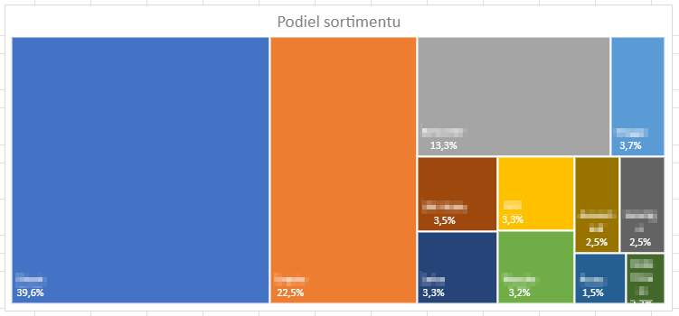
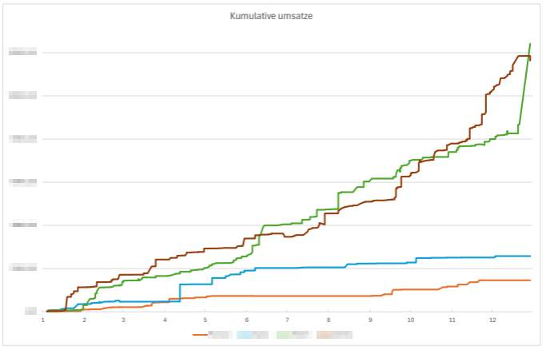
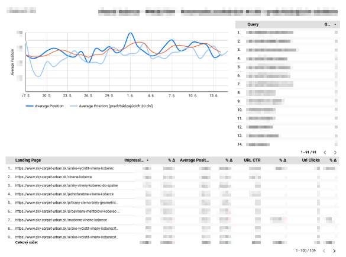

# AnalyticPortfolio
Projekty zamerané na analýzu údajov, **sú súčasťou mojej práce v SKY Carpet Slovakia s.r.o.**
Mám skúsenosti s analýzou obchodných dát, tvorbou vizualizácií a sledovaním KPI. Najčastejšie pracujem v **Exceli** a **Pythone**, pričom priebežne skúšam **aj ďalšie nástroje**. Na analytike ma baví hľadať súvislosti a prepájať čísla s odporúčaniami, ktoré dávajú zmysel pre biznis. Záleží mi na tom, aby výstupy prinášali reálnu hodnotu a pomohli zlepšiť produkt či službu.

## 1. Data Cleaning
> :memo: **Použité nástroje / Technológie:** JupiterStudio, Python + Pandas
- Cieľ projektu
  - Očistenie kontaktných údajov z fakturačného systému pre jeho ďalšie spracovanie
- Uskutočnené analýzy
  - Odstránenie duplicít, prázdnych znakov
  - Korekcia názov (kapitalizácia)
  - Korekcia PSČ, Tel č., Email
- Výsledky a odporúčania
  - Uskutočnená **korekcia u 7% údajov**
  - Vytvorenie **internej smernice pre zakladanie nového klienta** s cieľom zabezpečiť správnosť a konzistentnosť údajov.

## 2. Podiel obratu jednotlivých segmentov (Luxusný obchod s kobercami)
> :memo: **Použité nástroje / Technológie:** Excel
- Cieľ projektu
  - Identifikácia **najvýkonnejších/najslabších segmentov** tovaru v obrate
- Uskutočnené analýzy
  - Triedenie produktov podľa segmentov
  - Identifikácia najúspešnejších produktov (ks, obrat, marža)
  - Identifikácia podielu jednotlivých segmentov na obrate
- Výsledky a odporúčania
  - Vytvorené odporúčania pre konateľa, **ktoré segmenty podporiť v rozvoji** a ktoré **utlmiť / odstrániť**
  - Výsledok v monitorovanom období bolo **22% navýšenie obratu u segmentu, ktorí sme podporili v rozvoji**
 
  

## 3. Preverenie úspešnosti / korekcia pravidiel služby (Luxusný obchod s kobercami)
> :memo: **Použité nástroje / Technológie:** Excel
- Cieľ projektu
  - **Priebežné hodnotenie výkonnosti služby** zapožičania koberca pred zakúpením (služba odstraňuje bariéry v nákupe)
- Uskutočnené analýzy
  - Spracovanie štatistiky zapožičania, ktoré následne konvertujú na predaj
- Výsledky a odporúčania
  - Pri priebežnom hodnotení som **identifikoval závislosť správania sa klienta od hodnoty zápožičky** (3 segmenty)
  - Zo získaných informácií som pripravil **odporúčania na úpravu pravidiel služieb**, ktoré** ušetria prácnosť a spokojnosť klienta** so službou
 
## 4. Monitorovanie KPI výkonnosť predajcov (Luxusný obchod s kobercami)
> :memo: **Použité nástroje / Technológie:** Excel
- Cieľ projektu
  - Kvartálna **kontrola výkonnosti predajcov**, kontrola výkonnosti na podnet vedúceho personálu
- Uskutočnené analýzy
  - Podrobná analýza výkonnosti predajcov (10 rokov)
  - Hľadanie opakujúcich sa vzorcov správania (osvedčil sa Kumulatívny graf prírastku)
- Výsledky a odporúčania
  - **Identifikácia opakujúcich sa schém** u oslabeného výkonu, ktoré vyústili v pohovor so zamestnancom
  

## 5. Štatistika výkonnosti klientov a ich nákupného správania (Luxusný obchod s kobercami)
> :memo: **Použité nástroje / Technológie:** Excel
- Cieľ projektu
  - Identifikácia **najvýkonnejších klientov, vytvorenie databázy** pre predajcov / marketing
- Uskutočnené analýzy
  - Párovanie údajov naprieč pokladňou, fakturačného systému a databázou klientov
- Výsledky a odporúčania
  - Vytvorenie kvalitného **podlkladu pre rozličnné činnosti firmy**
  - Vytvorený **zoznam pre aktívne oslovenie pomocou marketingových nástrojov** (FB, Googe ADS, poštová zásielka, telefonický kontakt)
  - Vytvorenie **internej smernice pre zakladanie nového klienta** tak aby sa kumulovali údaje na jednom mieste.
  
## 5. Analýza návštevnosti webstránky (Luxusný obchod s kobercami)
> :memo: **Použité nástroje / Technológie:** Google Search Console, Google Looker
- Cieľ projektu
  - **Analýza trendov** návštevnosti dvoch eshopov
- Uskutočnené analýzy
  - Identifikácia trendov sezónneho tovaru
  - Analýza SEO stratégie
- Výsledky a odporúčania
  - *Tvorba dashboardu v Google Looker** pre jednoduchšie pravidelné monitorovanie konateľom a monitorovanie zmien v SEO
  - **Idnetifikácia sady kľúčových slov** pre tvorbu produktov
   

  
## Ostatné analýzy
- Analýza cenotvorby konkurencie
  - Manuálna rešerš od stola / in-situ
  - Dodávateľská optika
  - Získanie údajov z marketingových nástrojov (Google Ads/Merchant Center)
  - Vzájomné porovnanie metód a vytvorenie odporúčania na úpravu stratégie predaja
- Hodnota za peniaz
  - Kontinuálna stratégia hodnotenia, čo dostanem za daný peniaz
  - Identifikácia možných optimalizácií
  - Identifikácia výkonnosti potencionálnych investícií
- Monitorovanie KPI výkonnosť jednotlivých predajní
  - Hrubá, ako aj podrobná analýza jednotlivých predajní
  - Na základe pomeru nákladov a výkonu bola ukončená jedna z predajní
- Hodnotenie investičného potenciálu novej pobočky / sťahovanie
  - Zber údajov spojené s lokalitou, prieskum trhu, hodnotenie nájomných podmienok
  - Predzmluvné rokovania
  
## Work in progress
- Analýza predajnosti produktov u dodávateľov
   > :memo: **Použité nástroje / Technológie:** Python, SQL, Pandas
  - Na základe úbytku (nutná korekcia o prírastky)
  - Identifikácia najvýkonnejších produktov
  - Historický pohľad, predikcia predaja, (aj sezóna), predikcia ďalšieho naskladnenia
  - Hodnotenie sily trhu podľa intenzity predaja
  - Identifikácia podielu našej sily u jednotlivých dodávateľov

## Pozri: [PythonPortfolio](https://github.com/Frantik111/PythonPortfolio)
Nájdte tu moje technickejšie zručnosti, ktoré sa skvelo hodia k automatizovanej analýze údajov.
